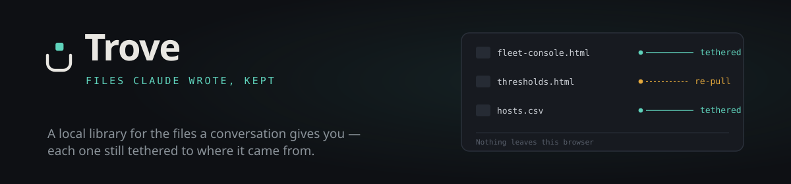

<p align="center">
  
</p>

<p align="center">
  <a href="https://chromewebstore.google.com/detail/trove/mikpichonjdjbnhjafkjiofacepfpffc"><b>Add to Chrome &rarr;</b></a> &nbsp;·&nbsp;
  <a href="https://ursacode.github.io/trove/">Site</a> &nbsp;·&nbsp;
  <a href="https://ursacode.com">UrsaCode</a> &nbsp;·&nbsp;
  <a href="https://chromewebstore.google.com/detail/trove/mikpichonjdjbnhjafkjiofacepfpffc"></a>
  <a href="https://chromewebstore.google.com/detail/trove/mikpichonjdjbnhjafkjiofacepfpffc"></a>
  <a href="LICENSE"></a>
</p>

---

**Files Claude wrote, kept.** A Chrome extension that turns the files Claude
generates in a conversation into a local library you own — browse them, read
them, edit them, and pull them again when the conversation moves on. Built and
maintained by [UrsaCode](https://ursacode.com).

## The problem

Files Claude writes live only inside the conversation that produced them. To
read one you click its card. To keep one you download it — and it becomes a
loose file in `~/Downloads` with no memory of where it came from, and no way to
know when Claude has changed it since.

Trove keeps those files, grouped by the conversation that made them, and keeps
the link back.

## What it does

| | |
|---|---|
| **Capture** | A **Keep** button on every file card in the conversation, and a popup that takes the whole conversation at once — with per-file progress, not a spinner. |
| **Browse** | Conversations on the rail, files in a table. One column tells you which of your copies have fallen behind. |
| **Read** | Any file opens on paper, full width, in its own tab. Nothing the extension owns is ever drawn over the document. |
| **Edit** | A real editor with syntax highlighting. Edits stay local — they never travel back to the conversation. |
| **Re-pull** | When Claude changes a file, Trove says so. One click takes the current version. |
| **Screenshot** | Save a PNG of a rendered file, with the extension's own furniture hidden. |
| **Auto-capture** | Optional, off by default. Trove catches files as Claude writes them. |

## Install

### From the Chrome Web Store

**[Add to Chrome](https://chromewebstore.google.com/detail/trove/mikpichonjdjbnhjafkjiofacepfpffc)** — this is the way to install it.

### From source

For development, or to run an unreleased change:

```bash
git clone https://github.com/UrsaCode/trove.git
cd trove
npm install
npm run build
```

Then in Chrome: **Extensions → enable Developer mode → Load unpacked → select
the `dist/` folder**.

`npm run dev` rebuilds on change. Press reload on the Trove card in
`chrome://extensions` after each rebuild.

## How it works

Claude exposes two private, per-conversation endpoints — one listing every file
in the conversation's sandbox with size and timestamp metadata, one returning a
file's bytes by path. Trove calls both from a content script running on
claude.ai, which is same-origin, so the session cookie attaches with no token
handling and no cross-site cookie risk.

The download endpoint returns a file's **current** content, not the version
frozen into the message that created it. That is the whole foundation: *re-pull*
is the same request issued again, and it works identically on a conversation you
opened five minutes ago or five months ago.

**Interception is a signal, not a source.** Trove also watches page traffic, but
only reads request URLs — never response bodies. Claude streams a file's full
text when it is created but only a diff when it is edited, so content
reconstructed from the stream would start correct and quietly go stale. The
observer only says *look again*; the API answers.

**Rendering is sandboxed.** Chrome extension pages forbid inline script, and an
iframe inherits its parent's policy — so a captured HTML file with inline
`<script>` would render blank. Previews run in a page declared under the
manifest's `sandbox` key, which has a relaxed policy and an opaque origin.
Captured code runs correctly and cannot reach your storage, the extension's
APIs, or your Claude session. Captured files are generated code you have not
necessarily read, and Trove treats them as untrusted throughout.

## Design

The extension is **a frame around someone else's document**. The chrome is
graphite and recedes; the captured file gets the only light surface on screen.
Colour is rationed to three meanings and used for nothing else:

| | Meaning |
|---|---|
| **Aqua** — tether | Your copy and the conversation still agree |
| **Amber** — moved | They disagree: the source moved on, an edit is unsaved, or edits are about to be overwritten |
| **Red** — sever | Destruction, and only destruction |

Four rules the interface holds itself to:

- **Mono is data.** If the filesystem produced the string — name, path, byte
  count, timestamp — it is IBM Plex Mono. If a person wrote it, it is Archivo.
- **Paper is sacred.** No badge, watermark, toolbar, or overlay is ever drawn on
  top of a rendered file. Controls live in the bands above and below it.
- **No history, say so.** Updates overwrite, so every screen that can destroy
  something names what is lost, in plain words, before it happens.
- **Local is a feature.** *Nothing leaves this browser* sits in the rail footer
  permanently, not in a settings page nobody opens.

## Privacy

Trove has no server, no account, and no analytics. It makes no network requests
except to `claude.ai`, using your existing session, to list and download the
files in a conversation you are looking at.

Everything it keeps lives in the extension's own IndexedDB on your machine.
Nothing is uploaded, shared, or synced — the only thing that leaves your browser
is a file you explicitly export.

### Permissions, and why

| Permission | Why |
|---|---|
| `https://claude.ai/*` | List and download the files in a conversation. This is the only host Trove ever contacts. |
| `storage` | Your settings. |
| `unlimitedStorage` | Captured files can be large; the default quota would cap the library at a few megabytes. |
| `tabs` | Find the claude.ai tab that can service a request, and open the Reader. |

Screenshots need one more, which Trove asks for **only when you first take
one** and never at install:

| Optional permission | Why |
|---|---|
| `<all_urls>` | Chrome's tab-capture API demands either this or `activeTab`, and `activeTab` is only granted when you invoke an extension from the toolbar — which never applies to a tab Trove opened for you. Trove only ever captures its own Reader tab, and the image never leaves your machine. Decline it and everything except screenshots works as normal. |

## Scope

Trove captures the files Claude generates into a conversation's output
directory. It does not capture images you uploaded, and it does not handle
classic Claude artifacts that never touch the sandbox filesystem.

Re-pulling **overwrites**; there is no version history. The one guard rail: if a
file has local edits *and* has changed upstream, Trove asks before replacing
your work. That is the only action it cannot undo.

Rendering handles single self-contained files. A file that references a sibling
file will render with that reference unresolved.

## Caveats

**The endpoints are private and undocumented.** They can change without notice.
All knowledge of them lives in `src/content/api.js`, so a break there is a
one-file repair.

**Card matching is a heuristic.** A card shows `Trove design`; the file is
`trove-design.html`. Trove matches the slugified title against the
conversation's known file list, and where two candidates match it refuses to
guess and offers a picker instead.

## Development

```bash
npm test          # vitest
npm run test:watch
npm run build     # -> dist/
npm run dev       # rebuild on change
```

Pure logic lives in `src/lib/` and is unit tested; browser-bound code stays
thin.

| Module | Responsibility |
|---|---|
| `lib/paths.js` | Sandbox path → name, extension, MIME, kind, category |
| `lib/diff.js` | new / unchanged / changed / conflict / orphaned |
| `lib/match-card.js` | Card title → sandbox path, refusing ambiguity |
| `lib/signal.js` | Whether a URL means "files may have changed" |
| `lib/naming.js` | Display names, and what a re-capture must not clobber |
| `lib/db.js` | IndexedDB, cascade delete, usage reporting |
| `lib/settings.js` | Defaults, validation, sync storage |
| `content/api.js` | The only module that knows Claude's endpoints |
| `content/capture.js` | Which files to fetch, and what a record carries |
| `background/router.js` | Message routing, the auto-capture gate, debounce |

See [CONTRIBUTING.md](CONTRIBUTING.md) to get started,
[docs/architecture.md](docs/architecture.md) for how the pieces fit, and
[docs/chrome-web-store.md](docs/chrome-web-store.md) for what publishing needs.

## Licence

[MIT](LICENSE) © UrsaCode
